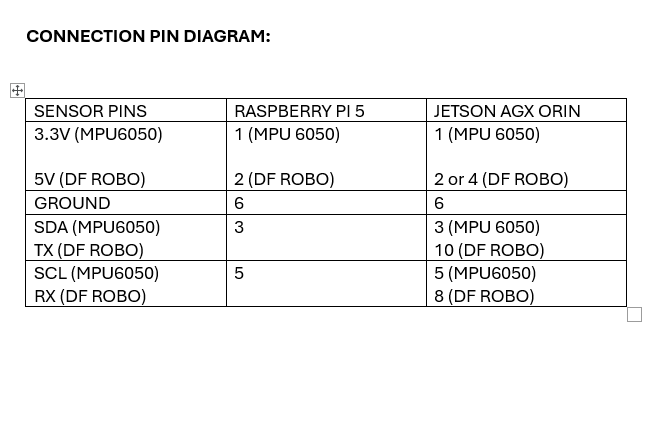

# Feature: Roll Stabilization

## Components Required

1. **DFRobot 6-Axis IMU Accelerometer** or **MPU6050 IMU**
2. **Jetson AGX Orin (64 GB)**
3. **Camera** (for video capture and transmission)

## Code Repository

> Code Link - [https://github.com/trxsrijani/roll_stabilization_code](https://github.com/trxsrijani/roll_stabilization_code)

## Statement of Purpose (SOP)

The objective of the roll stabilization feature is to implement automatic correction for roll-induced motion, ensuring a stable video feed from the WRSTG device mounted on a ship. The algorithm compensates for angular deviations—both clockwise and counterclockwise—maintaining video stability despite dynamic marine conditions.

## Connection Pin Diagram


---

## How to Verify if the Sensor is Connected

Use the following commands in the Linux terminal:

### For MPU6050 (I2C-based)
```bash
ls /dev/i2c*
```
This command lists all available I2C interfaces. If the MPU6050 is connected properly, you'll typically see `/dev/i2c-1`.

### For DFRobot 6-Axis IMU (UART-based)
```bash
ls /dev/ths*
```
This lists UART interfaces such as `/dev/ths0`, `/dev/ths1`, etc.

> **Note:** You may need to try multiple `/dev/ths*` interfaces to identify the correct one. In some systems, the relevant interface may already exist (e.g., `ths0`, `ths1`) even before the sensor is connected. This behavior was observed in previous setups.

---

## Intuition Behind the Code

The roll stabilization pipeline consists of the following steps:

1. **Import Required Libraries**  
   Modules like `threading`, `cv2`, `flask`, `serial`, `deque`, and `statistics` are used for multithreading, video streaming, serial communication, and smoothing.

2. **`DFRobotIMU` Class**  
   Initializes UART communication with the IMU. It reads binary data packets, extracts roll, pitch, and yaw, and converts them to usable angle values.

3. **`sensor_loop()` Function**  
   Continuously runs in a separate thread to update the global `current_roll` variable in real time. This ensures angle updates do not interrupt the video feed.

4. **`generate_frames()` Function**  
   Captures video frames, fetches the latest roll angle, applies counter-rotation to stabilize the image, and streams the corrected video over the web.

5. **Flask Web Server Endpoints**  
   - `/` – Serves the main HTML page  
   - `/video_feed` – Streams the stabilized video  
   - `/angle` – Returns the current roll angle in JSON format

6. **Thread Initialization**  
   A background thread is spawned to handle sensor data independently using:
   ```python
   t = threading.Thread(target=sensor_loop)
   t.daemon = True
   t.start()
   ```

---

## Point of Contact

For specific troubleshooting, contact the relevant team member:

- [**Srijani Som**](mailto:srijani@tractrix.in) – General troubleshooting  
- [**Dinesh Ram**](mailto:dineshramv13@gmail.com) – Algorithm logic & backend issues  
- [**Kaustubhya Shukla**](mailto:ksdoffl@gmail.com) – Cropping, blending, angle correction, frontend  
- [**Ankit Singh**](mailto:ankit@tractrix.in) – Miscellaneous issues

---